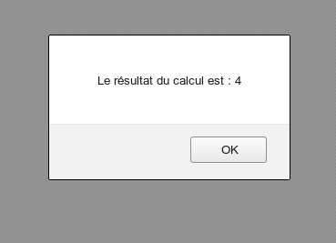
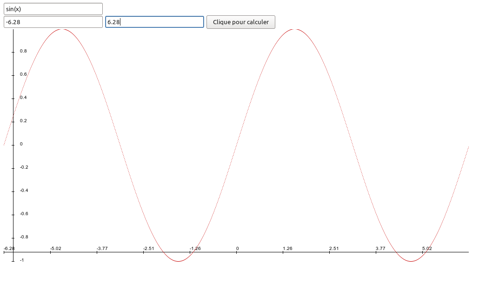

Projet THL
===========
Une calculette !

## Compilation

Il est nécessaire d'avoir flex, bison, node, npm et un compilateur C++ installé.

```
npm install
make
node-gyp configure
node-gyp build
node index.js
```
On peut maintenant ouvrir son navigateur sur http://localhost:3000

## Utilisation

Il y a trois champs sur la page. Le premier où l'on rentre la fonction. Sur les deux autres on rentre la borne de début et celle de fin pour l'intervalle où l'on veut observer la fonction. Il faut nécessairement rentrer tous les paramètres, mais une fonction constante donnera directement le résultat



# Format à suivre
On peut taper des nombres directement ainsi que les opérations de base + - * /.
On peut utiliser aussi une variable x ou des fonctions déjà implémentées comme la fonction sinus par exemple. La syntaxe est par exemple pour sinus `sin(x)`.


# Fonctions disponibles

| nom des fonction | utilisation |
|------|------|
| pi | pi = 3.14... |
| sinus | sin(x) |
| cosus | cos(x) |
| tangente | tan(x) |
| exponentiel | exp(x) |
| logarithme | log(x) |
| racine carré | sqrt(x) |
| puissance | pow(x,n) ou x^n |
| asinus | asin(x) |
| acosinus | acos(x) |
| atangente | atan(x) |
| sinus hyperbolique | sinh(x) |
| cosinus hyperbolique | cosh(x) |
| tangente hyperbolique | tanh(x) |
| asinus hyperbolique | asinh(x) |
| acosinus hyperbolique | acosh(x) |
| atangente hyperbolique | atanh(x) |
| fonction modulo | fmod(x,n) ou x%n |
| valeur absolu | abs(x) ou \|x\| |
| factorielle | fact(x) ou !x |
| coefficient binomiale | bino(x,n) |s
